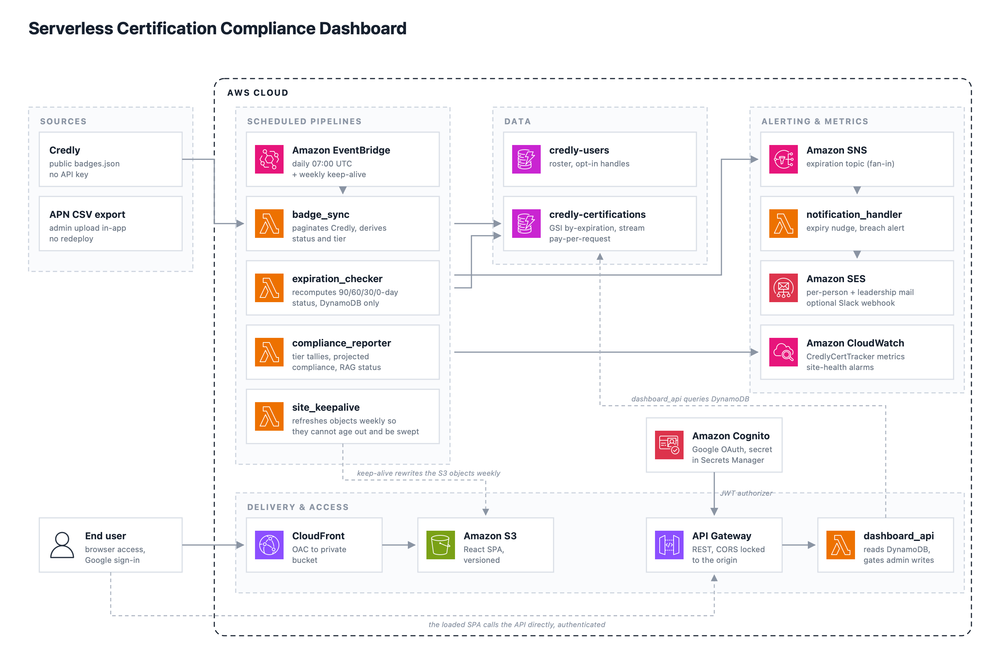

# Credly Certification Tracker

Serverless app that tracks AWS and Anthropic certifications across the team, computes AWS Partner Network / Claude Partner Network tier compliance, and shows a live dashboard with a leaderboard. Built on AWS CDK (Python) with a React/TypeScript frontend.

The deployed dashboard is internal and sign-in gated; its URL is an output of the
CDK stack (`DashboardUrl`) rather than something published here.

## Architecture


## Components

### Frontend (`frontend/`)
React + TypeScript + Vite, built to a static bundle and served via CloudFront + S3 (bucket blocks all public access; CloudFront reaches it through Origin Access Control). Login flow: user clicks "Sign in with Google" → redirected to the Cognito Hosted UI → Google OAuth → redirected back with an authorization code and a CSRF `state` value → app exchanges the code for tokens at Cognito's `/oauth2/token` endpoint → stores the `id_token`/`refresh_token`/expiry in `localStorage`. The token silently refreshes itself before expiry; if refresh fails, the user is signed out cleanly instead of seeing a raw 401.

### Auth
Cognito User Pool (`cert-tracker-users`) with self-sign-up disabled — the only way in is Google federation. The Google OAuth client secret lives in **AWS Secrets Manager** (`credly-cert-tracker/google-oauth-client-secret`), referenced dynamically by the CDK stack rather than embedded in the CloudFormation template. Callback/logout URLs are derived from the actual CloudFront distribution domain at synth time.

### API
One route: `GET /compliance`, behind a Cognito User Pool authorizer, backed by the `credly-dashboard-api` Lambda (`lambda/dashboard_api/handler.py`). It scans `credly-certifications` directly, computes AWS/Anthropic tier progress, and builds the leaderboard (dense ranking — ties share a rank rather than skipping numbers — cut off at the top 10 distinct rank groups, not the top 10 individuals). CORS is locked to the actual dashboard origin.

### Scheduled processing
- **Badge Sync** (`lambda/badge_sync/handler.py`) — runs daily at 07:00 UTC via EventBridge. Pulls opted-in users from `credly-users` (`consent_status = opted_in`), fetches each person's badges from Credly's public endpoint (`www.credly.com/users/<username>/badges.json`, no auth needed), and upserts AWS certs into `credly-certifications`.
- **Expiration Checker** (`lambda/expiration_checker/handler.py`) — runs daily at 07:00 UTC via a separate EventBridge rule, on the same trigger time as Badge Sync. Recomputes each cert's `status` based on days until expiry: `expired` (past due), `critical` (≤30 days), `expiring_soon` (≤60 days), `upcoming_renewal` (≤90 days), or `active`. Daily is sufficient because status is a pure function of the stored expiry date and today's date, so it can only change when a cert crosses a 90/60/30/0-day boundary.
- **Site Keep-Alive** (`lambda/site_keepalive/handler.py`) — runs weekly via EventBridge. Refreshes the hosting bucket's objects so an age-based cleanup cannot sweep the deployed frontend, and restores any objects hidden behind delete markers.

### Data stores
- **`credly-users`** — partition key `employee_id` (string). Known attributes in use: `credly_username`, `consent_status`, `email`, `name`.
- **`credly-certifications`** — partition key `employee_id`, sort key `certification_id`. Attributes written by Badge Sync: `certification_name`, `credly_username`, `issued_at`, `expires_at`, `status`, `partner_tier_category`, `badge_url`, `last_synced`. GSI `by-expiration`: partition key `status`, sort key `expires_at`.

### Notifications

There are two separate notification paths, and only one of them works.

**Slack digests and leaderboards — working.** `dashboard_api` posts directly to Slack incoming webhooks, with the webhook URLs and bot token read from Secrets Manager (`SLACK_WEBHOOK_SECRET`, `SLACK_BOT_TOKEN_SECRET`, `SLACK_ANTHROPIC_WEBHOOK_SECRET`). Three tasks are available, each invoked by payload rather than over the API:

```bash
aws lambda invoke --function-name credly-dashboard-api \
  --payload '{"task":"apn_gap_digest","dry_run":true}' /dev/stdout
```

- `apn_gap_digest` — who holds an AWS cert that APN is not crediting, with `users.lookupByEmail` resolving work emails to member IDs so the right people get @-mentioned
- `aws_leaderboard` and `anthropic_leaderboard` — monthly monospace bar charts, no pings; the Anthropic one posts to its own channel

All three accept `"dry_run": true` to render the message without posting. **Note:** no EventBridge rule for these exists in the CDK stack, so they are triggered manually or by a schedule created outside this repo. If you want them on a cadence tracked in code, add a rule.

**SES email and the SNS path — ⚠️ not functional.** This is the older expiry-reminder path and it does not run end-to-end:
- No Lambda in this codebase ever calls `sns.publish()`. The `CertTracker-Expiration-Alerts` SNS topic has a subscriber (`notification-handler`) but nothing feeds it, despite Expiration Checker having IAM permission to publish.
- The real intended path is different: Badge Sync's `create_reminder_schedules()` creates one-time **EventBridge Scheduler** entries per cert per reminder window (90/60/30 days out) that invoke `notification-handler` directly. This is gated behind `SCHEDULER_ROLE_ARN`, which the stack no longer sets at all, so `os.environ.get("SCHEDULER_ROLE_ARN", "")` falls back to `""` and the function bails out immediately every run. No schedules are ever created, and this has been the case since the feature was introduced (verified in git history). Note the latent trap: the unreachable branch below that guard reads `os.environ["NOTIFICATION_LAMBDA_ARN"]` by direct subscript, so simply setting a scheduler role without also wiring that variable would raise `KeyError`.
- Even if that were fixed, `notification-handler`'s `FROM_EMAIL` and `SLACK_WEBHOOK_URL` are also never set in the stack, so they'd fall back to a placeholder address (`certs@yourcompany.com`) and an empty Slack webhook respectively.

To make per-cert expiry reminders go out by email, this needs: (1) a real IAM role for `SCHEDULER_ROLE_ARN` that EventBridge Scheduler can assume to invoke `notification-handler`, and (2) a verified SES sender identity and a real `FROM_EMAIL`. Slack alerting is already covered by the digest path above, so the `SLACK_WEBHOOK_URL` on `notification-handler` is redundant.

### Reporting
`compliance-reporter` (`lambda/compliance_reporter/handler.py`) computes partner-tier compliance and publishes metrics to CloudWatch (namespace `CredlyCertTracker`), which back the CloudWatch alarms (RED/YELLOW thresholds per tier). Note: nothing in the CDK stack currently triggers this function on a schedule or via an event source — its invocation method needs to be defined (EventBridge rule, or called from elsewhere) if it isn't already handled outside this repo.

### External
Credly's public badges endpoint (`www.credly.com/users/<username>/badges.json`) — no API key or authentication required.

## Deployment

```bash
# one-time: store the Google OAuth client secret (never commit this value)
aws secretsmanager create-secret \
  --name credly-cert-tracker/google-oauth-client-secret \
  --secret-string "<google-client-secret>" \
  --region us-east-1

export GOOGLE_CLIENT_ID="<google-oauth-client-id>"

./deploy.sh
```

`deploy.sh` builds the frontend (`npm ci && npm run build` in `frontend/`) and runs `cdk deploy --all`.

## Local development

```bash
cd frontend
npm install
npm run dev
```

Requires `VITE_API_URL`, `VITE_COGNITO_DOMAIN`, and `VITE_USER_POOL_CLIENT_ID` in `frontend/.env` (see `frontend/.env.example`) pointing at a deployed stack's outputs.
